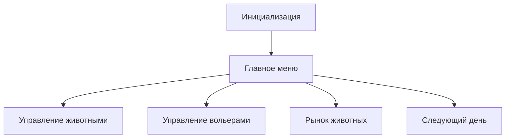

# 🦁 Zoo Management Simulator Pro 🐘

**Симулятор управления зоопарком нового поколения** — это комплексный проект, разработанный на языке C++ с использованием современных парадигм объектно-ориентированного программирования. Приложение предлагает **глубокий и захватывающий опыт** управления виртуальным зоопарком, где каждое ваше решение влияет на судьбу животных и успех всего предприятия.

## 🌍 Всеобъемлющее описание проекта

Это не просто симулятор — это **целая экосистема**, где:
- Каждое животное обладает уникальными характеристиками
- Динамическая система болезней создает непредсказуемые вызовы
- Реалистичная экономическая модель требует стратегического планирования
- Генетические механизмы позволяют создавать удивительных гибридов

Проект был создан как демонстрация **продвинутых возможностей C++**, включая:
- Работу с Unicode в консольных приложениях
- Систему умных указателей
- Сложные алгоритмы размножения животных
- Реалистичную модель старения и жизненного цикла

## 🎮 Глубокий геймплей (полное руководство)

### 🏗️ Основные механики
1. **Управление инфраструктурой**:
   - Строительство специализированных вольеров для разных биологических видов
   - Оптимизация пространства с учетом климатических требований
   - Контроль чистоты и санитарных условий

2. **Животные и их потребности**:
   - Система кормления с учетом видовых особенностей
   - Динамическое старение и реалистичная продолжительность жизни
   - Генетические алгоритмы размножения и наследования характеристик
   - Эпидемиологическая модель с рисками вспышек заболеваний

3. **Экономическая система**:
   - Балансировка бюджета между закупками, зарплатами и развитием
   - Система кредитования с процентами
   - Механизмы привлечения посетителей и увеличения доходов
   - Стратегическое ценообразование при продаже животных

4. **Управление персоналом**:
   - Найм специалистов разного профиля
   - Оптимизация рабочего процесса
   - Контроль расходов на зарплаты

### 🔍 Особые возможности
- **Система гибридизации** — создавайте уникальных животных, скрещивая разные виды!
- **Динамические события** — знаменитости, фотографы и другие неожиданные гости!
- **Катастрофы и кризисы** — будьте готовы к эпидемиям и другим ЧП!
- **Технологическое дерево** — развивайте свой зоопарк от маленького зверинца до крупнейшего заповедника!

## 📚 Документация:

## 🐾 Класс Animal

### Конструктор
```cpp
Animal(
    wstring n,         // Имя животного
    AnimalType t,      // HERBIVORE/CARNIVORE  
    Climate c,         // Климатическая зона
    double p,          // Базовая цена
    wstring desc,      // Описание
    double min_w,      // Минимальный вес
    double max_w,      // Максимальный вес  
    Gender g,          // Пол (MALE/FEMALE)
    wstring sp,        // Вид ("Лев", "Тигр")
    AnimalPtr p1 = nullptr,  // Родитель 1
    AnimalPtr p2 = nullptr,  // Родитель 2
    bool hybrid = false      // Гибрид ли
)
```

### 🏷️ Основные характеристики
**Метод	Возвращаемое значение**
- getName()	Имя животного
- getType()	HERBIVORE/CARNIVORE
- getClimate()	Предпочитаемый климат
- getSpecies()	Вид животного (например, "Лев")

### ⚙️ Состояние животного
```cpp
bool canReproduce()      // Может ли размножаться (возраст ≥5 дней, здорово)
bool canDieOfOldAge(int) // Проверка смерти от старости
void increaseAge()       // Увеличивает возраст на 1 день
```

**🌟 Особенности**
- Вес генерируется случайно в пределах [min_w, max_w]
- Гибриды получают комбинированные характеристики родителей
- Автоматическая проверка смерти от старости

### 🧬 Генетика
```cpp
static AnimalPtr breed(AnimalPtr a1, AnimalPtr a2) // Создание потомка
```
**Особенности:**
- Гибриды получают комбинированное имя
- Климат наследуется от одного из родителей
- Вес и цена - средние значения родителей

### 👷 Класс Worker
```cpp
enum WorkerType { VET, CLEANER, FEEDER, DIRECTOR };
```
| Должность | Зарплата/день |
|:----------:|:------------:|
| Ветеринар	|  $50        |
| Уборщик	|  $20        |
| Директор	|  $500       |

### 🏠 Класс Pen (Вольер)
```cpp
Pen(int capacity, AnimalType type, Climate climate)
```
### 🔍 Основные методы
```cpp
bool canAdd(AnimalPtr)    // Проверка совместимости
void addAnimal(AnimalPtr) // Добавление животного
```
### ⚠️ Управление болезнями
```cpp
void infectRandomAnimal(int day)  // 35% шанс заражения
void handleOutbreak(int day)      // При >50% зараженных
```
### 🛒 Класс AnimalMarket
```markdown
🔄 Обновление ассортимента:
- Стоимость: $200
- Частота: 1 раз в день
- Генерирует 10 случайных животных
```
### 🏰 Класс Zoo
**💰 Экономика**
```cpp
void nextDay() // Основная дневная логика:
1. Старение животных
2. Распространение болезней
3. Выплата зарплат ($20-500/работник)
4. Доход: 2 * популярность * кол-во животных
```
**📊 Оптимальное количество персонала**
|Роль	| Формула|
|:----------:|:----------:|
|Ветеринары	| 1 на 20 животных|
|Уборщики	| 1 на вольер|
|Кормильщики |	1 на 2 вольера|

### 🎮 Главный игровой цикл


### 📌 Особенности реализации
**Система болезней:**
- 35% шанс заражения при контакте
- Вспышки при >50% зараженных в вольере
**Генетика:**
- Межвидовое скрещивание с уникальными параметрами
**Экономика:**
- Динамический доход от посетителей
- Система кредитов под 20%

🏷️ Перечисления
```cpp
enum AnimalType { HERBIVORE, CARNIVORE };
enum Climate { TROPICAL, TEMPERATE, ARCTIC, DESERT };
enum Gender { MALE, FEMALE };
```

## 🛠️ Технические требования


### Минимальные:
- Процессор: Intel Core i3 или эквивалент
- ОС: Windows 7/10/11 (64-bit)
- 2 ГБ оперативной памяти
- 100 МБ свободного места на диске

### Рекомендуемые:
- Процессор: Intel Core i5 или лучше
- 4 ГБ оперативной памяти
- Терминал с поддержкой Unicode

## 📦 Установка и запуск

1. **Сборка из исходников**:
```bash
g++ -std=c++11 main.cpp -o zoo_simulator -O2
